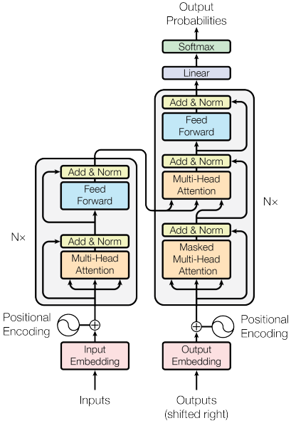
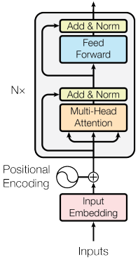
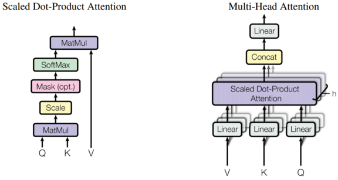
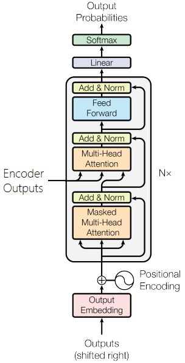
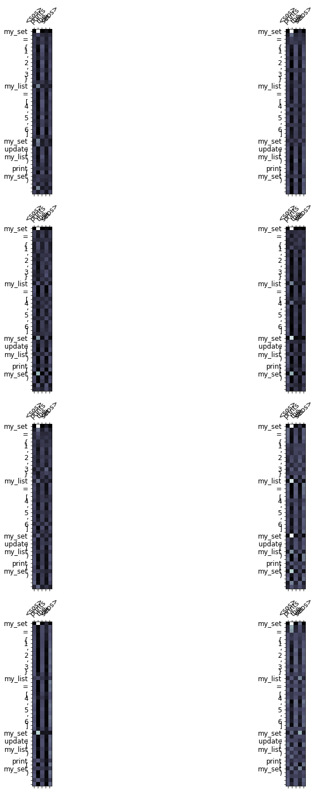

# CapStone Project for END Phase1
# English Sentence to Python Code conversion using BERT
The following are the important steps followed to get the desired results.


### Data Cleaning - 

* The original dataset is [here](https://drive.google.com/file/d/1rHb0FQ5z5ZpaY2HpyFGY6CeyDG0kTLoO/view?usp=sharing)
* We need to keep in mind the different indentations that might be present in the dataset.<br>
* So, we have used the browserling websites service to convert all the spaces present in the dataset into tabs.
* Since there might be space indentations of 2 or 3 or 4, we have converted the code multiple times with the space parameter in the website.
So, by doing this, we achieved the same indentation throughout the dataset to be tabs separated.<br>

* Apart from this, manual cleaning had to be done for some part of the dataset too which were not able to be automated.<br>

### Data Preparation and embedding strategy - 
 * The original data contains the python codes with the description.<br>
For example -  "# write a python program to add two numbers"

* As we can see in the above example, there is a clear discriminator in the form of hash to inform the interpreter that it is a comment.<br>
* So, we utilise this discriminator since it is uniform throughout the data to our advantage by taking the entire line after the has to be the description field and the newline which comes after that until the next encountered hash to be the code for the particular description.<br>
* This way, we were able to get only the description and also the code for it.<br>
* Code - 
```python
code_list = [[]]
filename = '/content/data_cleaned_tabs_only.txt'

with open(filename) as f:
    if line.startswith('#'):
      comment = line.split('\n#')
      if code_list[-1] != []:
        # Now we are in a new block
        code_list.append(comment)
    else:
      stripped_line = line#.strip()
      if stripped_line:
        code_list[-1].append(stripped_line)       
```
* Then, using the regex commands, we formatted the dataset and then we converted that to the pandas dataframe.
* Code - 
```python
raw_data_dict = {'Description' : [re.sub(r"^#(\d)*",'',x[0]).strip() for x in code_list], 'Code': [''.join(x[1:]) for x in code_list]}
df = pd.DataFrame(raw_data_dict, columns=["Description", "Code"])
```

* Then, using the autopep8 libraries fix_code() function, the codes obtained were reformatted to adhere the PEP8 Guidelines.
* Using the tokenize library in python, all of the code was tokenized.
```python
def fix_py(code):
  '''
  Fixing the raw code obtained by using autopep8 library
  '''
  code = autopep8.fix_code(code, options={'ignore': ['E402']})
  io_obj = io.StringIO(code)
  res = []
  prev_toktype = tokenize.INDENT
  last_lineno = -1
  last_col = 0
  for tok in tokenize.generate_tokens(io_obj.readline):
      token_type = tok[0]
      token_string = tok[1]
      start_line, start_col = tok[2]
      end_line, end_col = tok[3]
      ltext = tok[4]
      if start_line > last_lineno:
          last_col = 0
      if start_col > last_col:
          res.append(" " * (start_col - last_col))
      if token_type == tokenize.COMMENT:
          pass
      elif token_type == tokenize.STRING:
          if prev_toktype != tokenize.INDENT:
              if prev_toktype != tokenize.NEWLINE:
                  if start_col > 0:
                      res.append(token_string)
      else:
          res.append(token_string)
      prev_toktype = token_type
      last_col = end_col
      last_lineno = end_line
  res = ['\t' if a == '    ' else a for a in res]
  return res
  ```

#### Processing Dataframe - 

* We set the column names to be "Description" and "Code"
* We then drop all NaN values.
* Then we replace all tabs, new line and space characters with TAB, NL, SPC.
* Then, we sort values based on length.
* Then, based on the length of the code, we limit the code max length to be under 2000 tokens only.
* Using train_test_split function, we then split the dataset into train and test.
* The train and test dataframes are saved as tsv files.
* This way we tokenize and embed the python code into tokens which are learnable by the model.

### **Model**

<br>
* On a high-level, like any RNN based and CNN based sequence to sequence structure, Transformers is composed of an encoder and a decoder. The encoder converts the original input sequence into its latent representation in the form of hidden state vectors. The decoder tries to predict the output sequence using this latent representation.
* The input (source) and output (target) sequence embeddings are added with positional encoding before being fed into the encoder and the decoder. The encoding component is a identical stack of encoders and the decoding component is a identical stack of decoders of the same number, the paper used 6 stacks but we will be using only 3 stacks of encoder and decoder layers.
*Each encoder consists of two sub layers
a self-attention layer — a layer that helps the encoder look at other words in the input sentence as it encodes a specific word.
a feed-forward neural network , the exact same feed-forward network is independently applied to the word in each position through its own path in the encoder, hence it is called position-wise feed forward neural network.
* The decoder also has self attention and feed forward layers, but between them is another attention layer that helps the decoder focus on relevant parts of the input sentence by assisting it to look at specific parts.


#### **Encoder** - 
* Let’s now have a closer look at the Encoder structure.<br>
<br>
* Once the data is prepared these inputs are passed on to the next layer, that is the embedding layer. 
* The embedding layer too has an index for every word in the vocabulary and against each of those indices a vector is attached, initially these vectors are filled up with random numbers. Later on during training phase the model updates them with values that better help them with the assigned task.
* The transformer paper, have gone with the embedding size of 512 and we will use the same here.

#### **Encoder Layer** - 
* At a high level, an encoder receives a list of vectors as input. It processes this list by passing these vectors into a ‘self-attention’ layer, then into a feed-forward neural network, then sends out the output upwards to the next encoder.
* Here
we pass the source sentence and its mask into the multi-head attention layer
the output of this is passed to “Add and Norm” block (perform dropout on output of multi-head attention layer, apply a residual connection and pass it through a Layer Normalization layer).
then pass it through a position-wise feedforward layer
* The output of this is again passed to another “Add and Norm” block (a set of dropout, residual connection and a Normalization layer)
* “Add and Norm” within the transformer block plays a key role this is used to connect the inputs and outputs of other layers smoothly. we add a layer that contains a residual structure and a layer normalization after both the multi-head attention layer and the position-wise FFN network. Layer normalization can be thought of similar to batch normalization. One difference is that the mean and variances for the layer normalization are calculated along the last dimension (axis=-1) instead of the first batch dimension (axis=0).
* Layer normalization prevents the range of values in the layers from changing too much, which allows faster training and better generalization ability.

#### **Multi-Head Attention layer** -
* Let us dive further and understand the components of Multi-Head Attention layer.
<br>
* Attention mechanism helps the model to focus on important words in a given input sentence, transformers did not use simple attention, they used something called self attention. 
* Consider this sentence, “He went to the bank to deposit some money, after which he went to a river bank for a walk.” Note how same word bank means two different things, here the first occurance of bank is referring to a finance institution while the second bank refers to the side of a river. 
* So how can a model know which bank refers to what, we humans judge the meaning of the word by paying attention to the context in which it appears. 
* For instance, deposit and money can indicate that first occurance of the word bank refers to financial institute, the word river indicates the second occurance means a river bank like wise the meaning of every word can be regarded as the sum of the words it pays the most attention to.
* Now, the difference between simple and self attention is that, simple attention selectively focuses on words wrt to some external query, the more important the word is in determining the answer to that query the more focus it is given. Self attention on other hand also takes the relation ship among words within the same sentence into account and this is the layer where attention computation happen.

#### **Position-wise Feedforward Layer**  - 

* Another key component in the Transformer block is called position-wise feed-forward network (FFN) this is relatively simple compared to the multi-head attention layer. 
* It accepts a 3-dimensional input with shape [batch size, sequence length, hid dimension].
* The position-wise FFN consists of two dense layers. Since the same two dense layers are used for each position item in the sequence, we referred to it as position-wise. It is equivalent to applying two 1×1 convolution layers.
* The input is transformed from hid_dim to pf_dim, where pf_dim is usually a lot larger than hid_dim. The ReLU activation function and dropout are applied before it is transformed back into a hid_dim representation.

#### **Decoder** - 
* Transformer Decoder is almost similar to the Encoder block.
* Besides the two sub-layers (the multi-head attention layer and the positional encoding network), the decoder Transformer block contains a third sub-layer, which applies multi-head attention on the output of the encoder stack.
* Similar to the Transformer encoder block, the Transformer decoder block employs ‘Add and norm’, i.e., the residual connections and the layer normalization to connect each of the sub-layers.
<br>

### **Loss Function** - 

For loss function, it was found out that the CrossEntropyLoss is the best for this kind of problems. Although, we need to try CTCLoss function yet.

### **Evaluation Metrics** - 
**BLEU Score**

The Bilingual Evaluation Understudy Score, or BLEU for short is a method for automatic evaluation of machine translation. BLEU is a score for comparing/evaluating a candidate translation (translated sentence) of text to one or more reference translation (ground truth). 
It is based on "text string matches" i.e it quantifies how good a machine translation by computing a similarity score based on ngram precision.

BLEU score can also be used to evalutate a wide range of text generation NLP tasks like language generation, image caption generation, text summarization etc.

Few benefits of BLEU score:
  - Quick and inexpensive to calculate
  - easy to understand
  - language independent


BLEU metrics ranges from 0 to 1. The higher the BLEU Score the better.

**Displayed Attention for evaluation**
* Apart from BLEU Score, we use matplotlib to plot the attention mechanism of the model wrt to each input sentence and predicted code.<br>
* This helps us in better understanding of the model, where we can see what part of the input sentenec constitutes what part of the prediction.<br>
<br>


### **Example Outputs** - 
```python
****************************************************************************************
write a python program to check and print if a number is prime 

******************************************** Given Solution ********************************************
num = 407
if num > 1:
	for i in range(2, num):
	if (num % i) == 0:
        print(num, "is not a prime number")
        break
	else:
        print(num, "is a prime number")
else:
	print(num, "is not a prime number")

******************************************** Predicted Solution ********************************************


num = 407


if num > 1:
	for i in range(2, num):
	if (num % i == 0):
        print(num, "is not a prime number")
        print(num, "times", num // i, i, i, i, i, i, i)
        break
	else
****************************************************************************************
comprehension 

******************************************** Given Solution ********************************************


l_range = 2
u_range = 5
a = [(x, x**2) for x in range(l_range, u_range + 1)]

******************************************** Predicted Solution ********************************************


l_range = 2
u_range = 5
a = [(x, x, y) for x in range(l_range, u_range + 1)]

****************************************************************************************
write a function to return the cartisian distance between two points 

******************************************** Given Solution ********************************************
def cal_cart_distance(x1: float, y1: float, x2: float, y2: float) -> float:
	return ((x1 - x2)**2 + (y1 - y2)**2)**(1 / 2)

******************************************** Predicted Solution ********************************************
def cal_cart_distance(x1: float, y1: float, y2: float, y2: float) -> float:
	return (x1 - x2)**2 - y2:
	return - (x2)**2 - (1 - x1)**2)**2

****************************************************************************************
write a python program to convert a list into a nested dictionary of keys . 

******************************************** Given Solution ********************************************
num_list = [1, 2, 3, 4]
new_dict = current = {}
for name in num_list:
	current[name] = {}
	current = current[name]
print(new_dict)

******************************************** Predicted Solution ********************************************
my_list = [{}, {}, {}, {}, {}, {}, {}, {}, {}, {}, {}]
my_list[{value for key, value in zip(list1, list2)]
print(list2)

****************************************************************************************
write a python program to use extend in list/ append to a list 

******************************************** Given Solution ********************************************
a = [13, 56, 17]
a.append([87])
a.extend([45, 67])
print(a)

******************************************** Predicted Solution ********************************************
a = [10, 20, 30, 40, 50]
list2 = [98, 67]
for i in list1:
	if a.append(a)
	max1 = a[i]
print(a, b)

****************************************************************************************
42 . python program to transpose a matrix using nested loop 

******************************************** Given Solution ********************************************


X = [[12, 7],
     [4, 5],
     [3, 8]]

result = [[0, 0, 0],
          [0, 0, 0]]

for i in range(len(X)):
	for j in range(len(X[0])):
	result[j][i] = X[i][j]


for r in result:
	print(r)

******************************************** Predicted Solution ********************************************


X = [[12, 7],
     [4, 5,
     [7, 8]]


Y = [[5, 8, 0],
     [6],
     [0, 0]
     [0,
     [0, 0]]

result = [0,
          [0, 0, 0, 0]
****************************************************************************************
insert a number at the beginning of the queue 

******************************************** Given Solution ********************************************
q = [1, 2, 3, 4]
q.insert(0, 5)
print(f"Revised List:{q}")

******************************************** Predicted Solution ********************************************
q = [1, 2, 3]
q.insert(0, 5)
print(f"Revised List:{q}")

****************************************************************************************
49 . python function for finding the logarithmic value of a number 

******************************************** Given Solution ********************************************
def log(x):

	return math.log(x)

******************************************** Predicted Solution ********************************************
def log(x):
	return math.log(x)

****************************************************************************************
insert a number at the beginning of the queue 

******************************************** Given Solution ********************************************
q = [1, 2, 3, 4]
q.insert(0, 5)
print(f"Revised List:{q}")

******************************************** Predicted Solution ********************************************
q = [1, 2, 3]
q.insert(0, 5)
print(f"Revised List:{q}")

****************************************************************************************
86 write a program to convert meters into yards 

******************************************** Given Solution ********************************************
num = float(input("Enter the distance measured in centimeter : "))


inc = num / 2.54
print("Distance in inch : ", inc)

******************************************** Predicted Solution ********************************************


inc = 2.54
print("Distance in inch : ", inc)

****************************************************************************************
write a python program to make use of regular expression for matching 

******************************************** Given Solution ********************************************


print(
	'Find the characters in the given string:',
	re.findall(
        r'[a-z]+',
        '123FOO456',
        flags=re.IGNORECASE))

******************************************** Predicted Solution ********************************************


print(re.findall('123', s))

****************************************************************************************
calculating simple interest 

******************************************** Given Solution ********************************************
si = (p * r * t) / 100

******************************************** Predicted Solution ********************************************
si = (p * r * t) / 100

****************************************************************************************
write a python function to convert decimal to binary 

******************************************** Given Solution ********************************************
def convertToBinary(n):
	if n > 1:
	convertToBinary(n // 2)
	print(n % 2, end='')

******************************************** Predicted Solution ********************************************
def convertToBinary(n):
	if n <= 1:
	convertToBinary(n)
	print(n - 1)

****************************************************************************************
height as input 

******************************************** Given Solution ********************************************
def prism_volume(base_area, height):
	volume = base_area * height
	return volume

******************************************** Predicted Solution ********************************************
def cone_surface_area(radius, height):
	surface_area = 3.14 * (radius ** 2) * height
	return volume

****************************************************************************************
write a python program to print calendar of a given year 

******************************************** Given Solution ********************************************


import calendar

year = 2019
print(calendar.calendar(year))

******************************************** Predicted Solution ********************************************


import calendar
year = 2019
print(calendar.calendar(year))

****************************************************************************************
64 function to build a time elapsed closures 

******************************************** Given Solution ********************************************
def time_elsaped():
	start = perf_counter()

	def inner():
	nonlocal perf_counter
	return perf_counter() - start
	return inner

******************************************** Predicted Solution ********************************************
def time_elsaped():
	start = perf_counter()
	start = time.perf_counter()
	def inner():
	nonlocal perf_counter
	return perf_counter()
	return perf_counter()

****************************************************************************************
write a python function to multiply all values in the list 

******************************************** Given Solution ********************************************
def multiplyList(myList):
	result = 1
	for x in myList:
	result = result * x
	return result

******************************************** Predicted Solution ********************************************
def multiplyList(myList):
	result = 1
	for x in myList:
	result = result * x
	return result

****************************************************************************************
with side as length , width and height as input 

******************************************** Given Solution ********************************************
def rec_prism_surface_area(length, width, height):
	surface_area = 2 * ((length * width)
                        + (width * height) + (height * length))
	return surface_area

******************************************** Predicted Solution ********************************************
def rec_prism_volume(length, width, height):
	volume = length * breadth * height
	return surface_area

****************************************************************************************
are divisible by 5 and 7 , between 1 and 1000 inclusive . 

******************************************** Given Solution ********************************************
import random
print(
	random.sample(
        [i for i in range(1, 1001) if i % 5 == 0 and i % 7 == 0],
        5))

******************************************** Predicted Solution ********************************************
import random
print(random.sample([i for i in range(100, 1001) if i % 5 == 0],

****************************************************************************************
write a python program to convert uppercase string to lower 

******************************************** Given Solution ********************************************


a = 'STRING'
print(f'convert lowercase to uppercase:{a.lower()}')

******************************************** Predicted Solution ********************************************


a = 'STRING'
print(f'convert lowercase to uppercase:{a.lower()}')

****************************************************************************************
cleaned string . 

******************************************** Given Solution ********************************************
punctuations = '''!()-[]{};:'"\\,<>./?@#$%^&*_~'''
my_str = "Hello!!!, he said ---and went."
no_punct = ""
for char in my_str:
	if char not in punctuations:
	no_punct = no_punct + char
print(no_punct)

******************************************** Predicted Solution ********************************************
punctuations = '''!()-[]{};:'"\\,<>./?@#$%^&*_~'''
my_str = "Hello!!!, he said ---and went."
no_punct = ""
for char in my_str:
	if char not in punctuations:
	no_punct = no_punct no_punct + char


print(no_punct)

****************************************************************************************
list of allowed users 

******************************************** Given Solution ********************************************
user1 = "Ram"
user2 = "Mohan"

******************************************** Predicted Solution ********************************************
user1 = "Ram"
user2 = "Mohan"

****************************************************************************************
number 

******************************************** Given Solution ********************************************


def collatz(n):
	while n > 1:
	print(n, end=' ')
	if (n % 2):

        n = 3 * n + 1
	else:

        n = n // 2
	print(1, end='')

******************************************** Predicted Solution ********************************************


def collatz(n):
	while n > 1:
	print(n, end=" ")
	if (n % 2):
	print(n + str(n))


****************************************************************************************
public vs. private class methods and name mangling 

******************************************** Given Solution ********************************************
def public_method(self):
	print('Hello public world!')


def __private_method(self):
	print('Hello private world!')


def call_private_method_in_class(self):
	self.__private_method()


my_instance = my_class()


my_instance.public_method()
my_instance._my_class__private_method()
my_instance.call_private_method_in_class()

******************************************** Predicted Solution ********************************************


def public_method(self):
	print('Hello public world!')


def call_private_method_in_class(self):
	self.__private_method(self)


def call_private_method_in_class(self):


my_instance call_private_method_in_class(self):


my_instance.public_method()
my_instance.public_method()
my_instance.public_method(
****************************************************************************************
prints the set 

******************************************** Given Solution ********************************************
my_set = {1, 2, 3}
my_list = [4, 5, 6]
my_set.update(my_list)
print(my_set)

******************************************** Predicted Solution ********************************************
my_set = {1, 2, 3}
my_list = [4, 5, 6]
my_set.update(my_list)
print(my_set)
```